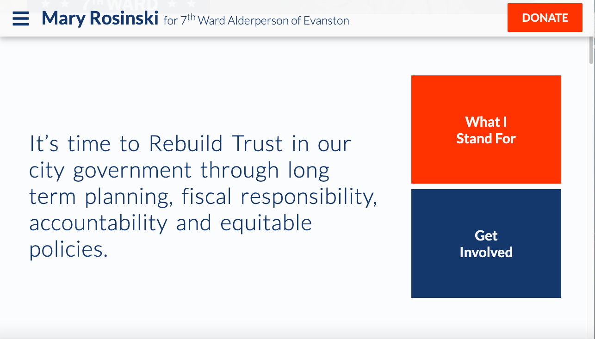
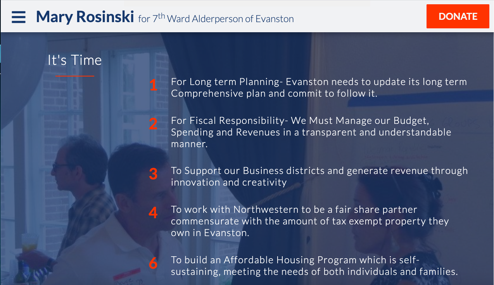
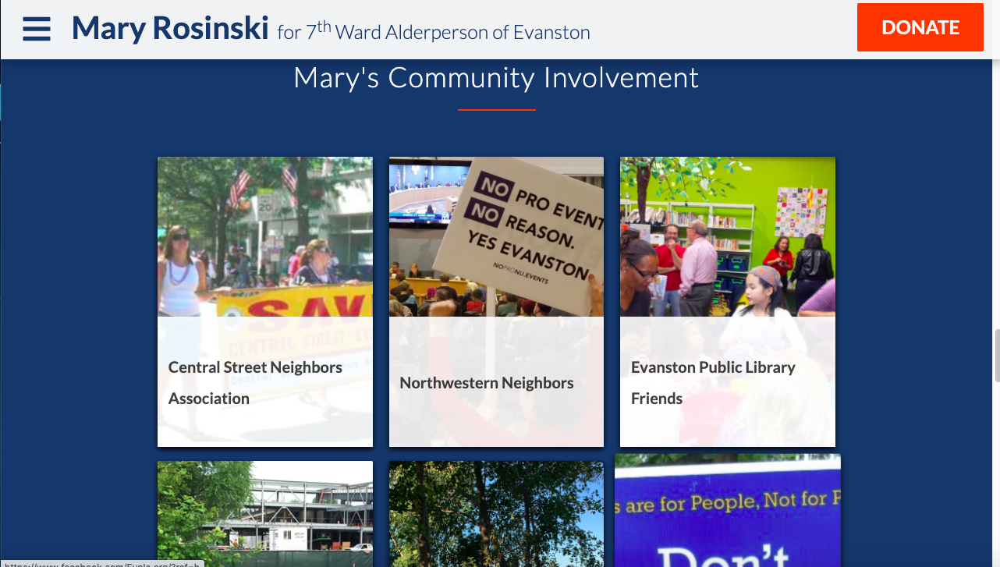
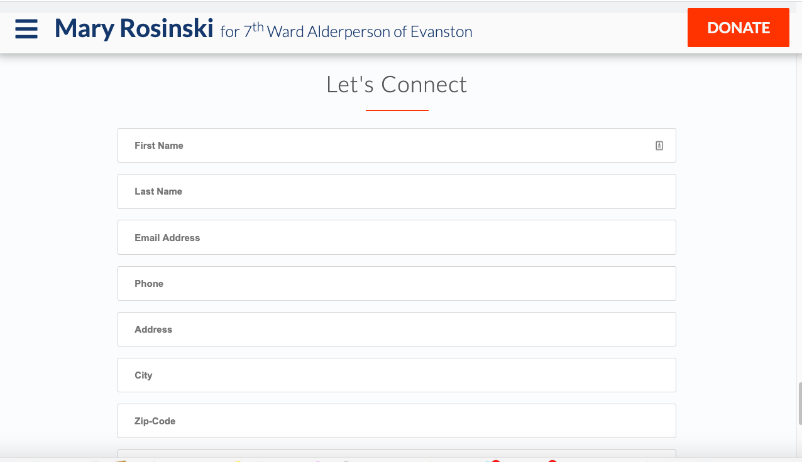

<h1 align="center"><strong>Mary Rosinski for Evanston, Illinois' 7th District Alderperson</strong></h1>

<h4 align="center"><em>Checkout out the website at Rosinski2021.org </em></h4>

---

<h4 align="center">Created: 1/8/2020</h4>
<h4 align="center">Last Updated: 1/19/2020</h4>

---

<h4 align="center"><strong>Created By: Teresa Rosinski and Benjamin Jacobs</strong></h>

[]
[**BenjaminJacobs**](https://github.com/benjovi09)

  
[**TeresaRosinski**](https://github.com/TeresaRosinski)

---

## Functionality

**The purpose of this site is to inform voters in Evanston's 7th district of Mary Rosinski's views and qualifications. After a constituent views her webpage, they will hopefully be drawn to join her mailing list, donate money to her campaign and vote for her. Additionally, the webpage provides a way for useres to contact Mary directly (through EmailJS) and stores their information in a firebase database.**

**This project is built with React, Firebase and EmailJs.**
**It is fully responsive and can be viewed on both small and large devices**

### Flow of the website

##### This is a current, collaborative project. Benjamin Jacob's manages most of the database aspect of the code while Teresa Rosinski designed and built the front-end.

## Setup/Installation Requirements

#### To quickly see the functionlaity of this project visit: [Mary Rosinski For 7th Ward Alderperson](https://Rosinski2021.org)

#### Clone the GitHub repository by running git clone  in the terminal.Or download the ZIP file by clicking on Code then Download ZIP from this repository.

#### Open the program in a code editor.

#### In the terminal, CD into 'habi-sabi'

#### Type 'npm install' in the command line to install the necessary packages.

#### Type 'npm start' in the command line to run the program.

#### Further directions automatically generated by create-react-app are listed below.

## Known Bugs

---

## Support and contact details

### Name: Teresa Rosinski

#### GitHub:[TeresaRosinski](https://github.com/TeresaRosinski)

#### LinkedIn: [TeresaRosinski](https://www.linkedin.com/in/teresarosinski/)

#### Email: trosinski89@gmail.com

### Name: Benjamin Jacobs

#### GitHub:[Benjamin Jacobs](https://github.com/benjovi09)

#### LinkedIn: [Benjamin Jacobs](https://www.linkedin.com/in/benjamin-jacobs-b7833b143/)

#### Email: ishouldreadmore@gmail.com

---

## Technologies Used

#### Visual Studio Code

#### Javascript

#### React

#### HTML / CSS 

#### Firebase

---

## License

Copyright (c) 2020 **_Teresa Rosinski, Benjamin Jacobs_**

This software is licensed under the MIT license.

This project was bootstrapped with [Create React App](https://github.com/facebook/create-react-app).

## Available Scripts

In the project directory, you can run:

### `npm start`

Runs the app in the development mode. 
Open [http://localhost:3000](http://localhost:3000) to view it in the browser.

The page will reload if you make edits. 
You will also see any lint errors in the console.

### `npm test`

Launches the test runner in the interactive watch mode. 
See the section about [running tests](https://facebook.github.io/create-react-app/docs/running-tests) for more information.

### `npm run build`

Builds the app for production to the `build` folder. 
It correctly bundles React in production mode and optimizes the build for the best performance.

The build is minified and the filenames include the hashes. 
Your app is ready to be deployed!

See the section about [deployment](https://facebook.github.io/create-react-app/docs/deployment) for more information.

### `npm run eject`

**Note: this is a one-way operation. Once you `eject`, you can’t go back!**

If you aren’t satisfied with the build tool and configuration choices, you can `eject` at any time. This command will remove the single build dependency from your project.

Instead, it will copy all the configuration files and the transitive dependencies (webpack, Babel, ESLint, etc) right into your project so you have full control over them. All of the commands except `eject` will still work, but they will point to the copied scripts so you can tweak them. At this point you’re on your own.

You don’t have to ever use `eject`. The curated feature set is suitable for small and middle deployments, and you shouldn’t feel obligated to use this feature. However we understand that this tool wouldn’t be useful if you couldn’t customize it when you are ready for it.

## Learn More

You can learn more in the [Create React App documentation](https://facebook.github.io/create-react-app/docs/getting-started).

To learn React, check out the [React documentation](https://reactjs.org/).

### Code Splitting

This section has moved here: https://facebook.github.io/create-react-app/docs/code-splitting

### Analyzing the Bundle Size

This section has moved here: https://facebook.github.io/create-react-app/docs/analyzing-the-bundle-size

### Making a Progressive Web App

This section has moved here: https://facebook.github.io/create-react-app/docs/making-a-progressive-web-app

### Advanced Configuration

This section has moved here: https://facebook.github.io/create-react-app/docs/advanced-configuration

### Deployment

This section has moved here: https://facebook.github.io/create-react-app/docs/deployment

### `npm run build` fails to minify

This section has moved here: https://facebook.github.io/create-react-app/docs/troubleshooting#npm-run-build-fails-to-minify
